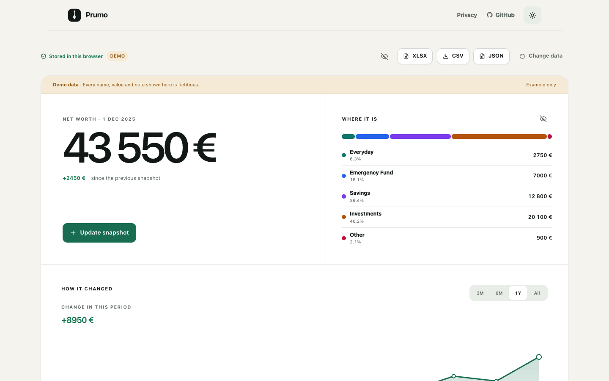

# Prumo

## Know where you stand. Keep it yours.

[](LICENSE)
[](package.json)

Prumo is a private, local-first net worth tracker. Open your spreadsheet in the browser with no account, bank connection, or financial-data upload — or run Prumo locally with SQLite and verified backups.

> **Your file. Your browser. Your data.**



[Open Prumo Web](apps/web) · [Run Prumo locally](#run-locally) · [Read the case study](docs/case-study.md)

The public deployment URL will be added only after deployment is reviewed and approved. Until then, the Web app can be run from this repository.

## Try in the browser

Prumo Web is the fastest way to understand the product. It is a static, client-side application with three clear starting points:

- **Open your file** — choose an `.xlsx` or `.csv` file and review it before importing;
- **Start with a template** — begin with a simple spreadsheet that you own;
- **Explore demo** — open a clearly labelled set of fictional data immediately.

Financial files are parsed in the browser. They are not sent to an upload endpoint, stored on a server, or used for analytics. Browser persistence uses IndexedDB; small interface preferences may use local storage. Export remains available so the data never depends on Prumo.

```sh
npm install
npm run web:dev
```

The Web app also has its own build and test commands:

```sh
npm run web:test
npm run web:build
```

## Record snapshots, not every coffee

Most finance software starts with transactions. Prumo starts with a simpler question: **what do you have right now?**

```text
1 Jan   €3,400
1 Feb   €3,750
1 Mar   €3,620
```

Update a snapshot when it is useful, then see how the total and its distribution change over time. There are no receipts to file, daily purchases to categorise, budgets to maintain, or bank feeds to connect.

## Start with what you already have

Bring the spreadsheet you already use. Prumo maps its date, note, and value columns into a small internal snapshot model, shows a preview, and identifies invalid rows, exact duplicates, date conflicts, and unknown columns before anything is accepted.

A public template keeps the format deliberately legible:

| Date | Everyday | Savings | Investments | Emergency Fund | Other | Note |
| --- | ---: | ---: | ---: | ---: | ---: | --- |
| 2026-01-01 | 850.00 | 2400.00 | 1800.00 | 1550.00 | 160.00 | Fictional example |

Excel is an entry point, not a hidden database. After import, Prumo works with a normalised local model and can export the result again.

## Your data is portable by default

You should be able to leave Prumo at any time and keep your data. Prumo Web exports:

- XLSX for a familiar spreadsheet workflow;
- CSV for a simple, widely readable table;
- JSON for a complete, structured copy.

The source file remains under your control. Prumo v0.1.0 uses manual open and download as the compatible baseline; it does not retain a browser file handle.

## Privacy, by mode

Marketing claims in this project are treated as technical claims. The two editions have different execution boundaries:

### Prumo Web

- no account or authentication;
- no bank connection;
- no analytics or telemetry;
- financial files processed in the browser;
- no endpoint that accepts financial files;
- no server-side financial storage;
- browser-local persistence and user-initiated export.

### Prumo Local

- SQLite data stored at a local path chosen by the user;
- verified JSON backups and portable CSV export;
- a server bound explicitly to `127.0.0.1` with local host/origin checks;
- no analytics, bank integrations, or external financial APIs;
- optional storage on a macOS encrypted volume;
- Privacy Mode for hiding values on screen — not a substitute for disk encryption.

Read the full [privacy and security explanation](docs/privacy-and-security.md) and [security policy](SECURITY.md).

## Features

| Capability | Prumo Web | Prumo Local |
| --- | --- | --- |
| Snapshot-based net worth dashboard | Yes | Yes |
| XLSX and CSV import with preview | In the browser | Through the localhost app |
| Fictional demo and starter template | Yes | Fictional demo |
| XLSX, CSV, and JSON portability | Yes | CSV and complete JSON |
| Browser-local persistence | IndexedDB | — |
| Persistent SQLite storage | — | Yes |
| Verified local backups and restore | — | Yes |
| Privacy Mode and light/dark themes | Yes | Yes |
| Purchase simulator and command palette | — | Yes |

Prumo is not a budgeting app, transaction tracker, bank aggregator, cloud-sync service, or multi-user financial platform.

## Run locally

Prumo Local is the existing, more persistent edition. It keeps the application and financial data on the same Mac and adds SQLite, automatic local backups, restore validation, localhost safeguards, a temporary purchase simulator, quick edit, and a command palette.

Requirements: macOS and Node.js 22 or later.

```sh
git clone <repository-url> prumo
cd prumo
npm run finance
```

The launcher prepares dependencies outside the project volume and starts Prumo at `http://127.0.0.1:3000`. It never binds to the local network by default.

The complete guide — including encrypted-volume configuration, database initialization, migrations, backup retention, restore recovery, troubleshooting, and the double-click launcher — is in [docs/local-setup.md](docs/local-setup.md).

## Screenshots

All public captures must use the fictional demo dataset and carry a visible demo label. The maintained set lives in [`docs/screenshots/`](docs/screenshots/) and covers the Web and Local dashboards, light and dark themes, import, simulator, mobile layout, Privacy Mode, and file selection.

## Architecture

Prumo shares the snapshot model, validation, calculations, formatting, chart logic, and UI primitives where the two runtimes allow it. The storage boundary is deliberately different.

```text
Prumo Web

XLSX / CSV
    ↓
browser parser → snapshot model → Prumo UI
                         ↕
                      IndexedDB
                         ↓
                 XLSX / CSV / JSON


Prumo Local

browser → localhost-only Next.js app → shared domain/services → SQLite
                                                        └──→ verified local backups
```

The Web app has no financial upload route or financial backend. The Local app has server routes because the server and SQLite database run on the user's own machine. See [product decisions](docs/product-decisions.md) for the reasoning behind those boundaries.

## Open source

Prumo is released under the [MIT License](LICENSE). The repository includes the product code, architecture and privacy decisions, test suite, and contribution process. No stars, usage figures, or adoption metrics are claimed.

- [Contributing](CONTRIBUTING.md)
- [Security policy](SECURITY.md)
- [Changelog](CHANGELOG.md)
- [Brand and copy guide](docs/brand-and-copy.md)
- [Web network-audit protocol](docs/network-audit.md)
- [v0.1.0 release notes](docs/release-notes-v0.1.0.md)
- [Case study](docs/case-study.md)

Before opening a pull request, run the checks for the edition you changed and never attach real financial files, database contents, backups, screenshots, paths, or logs.

## About the name

*Prumo* is Portuguese for a plumb line — a simple reference that shows whether something is truly aligned. The product applies that same idea to personal finances: know where you stand, without giving up ownership of the data that got you there.
